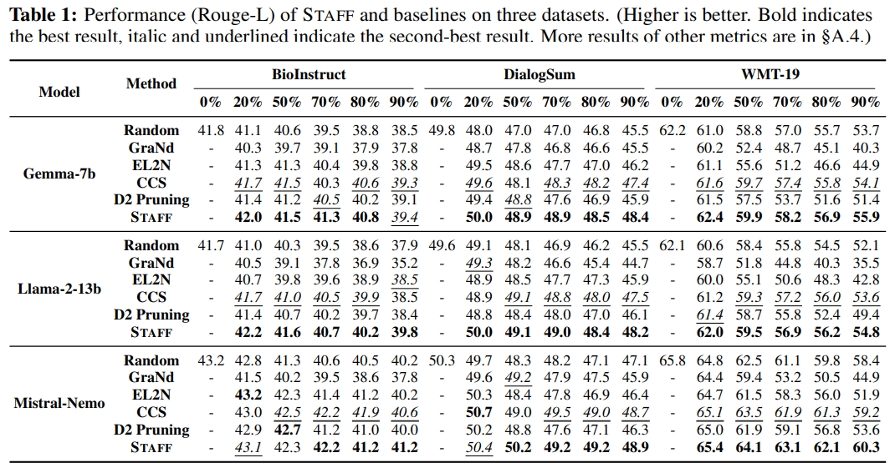

# STAFF

## TL;DR

We propose a novel and efficient data selection method, *STAFF*, based on the concept of
speculative execution.
STAFF first leverages a small model in the same family of the target LLM as the speculative model to calculate the data importance score.
It then verifies the scores on the target LLM to accurately identify the important data regions and allocates more budget for important samples.
Our experiment results on three LLMs and three downstream tasks demonstrate that STAFF can effectively select the coreset at different pruning rates, improving SOTA results by up to 35.1% while reducing selection costs by up to 70.5%


*Note that STAFF is still a prototype, and we will keep improving it and our dataset.*


## Repo Structure

```                 
- STAFF/   
    - selection
        - selected_data
        - effort_score.py
        - selection.sh
    - finetune
        - llamafactory_files
        - finetune.py
        - finetune-select.py
        - eval.py
    - README.md
    - requirements.txt    
```

## Setup

STAFF is implemented on Python 3.10.
To install all dependencies, please get into this directory and run the following command.
```
pip install -r requirements.txt
```

We use the LLaMA-Factory framework to perform fine-tuning and inference. Please follow the instructions in their [repository](https://github.com/hiyouga/LLaMA-Factory) to configure the framework.
Please run this [script](./finetune/copyllamfactory.sh) to copy some required files to your LLaMA-Factory before install.


We provide configuration files related to the [Gemma-7b model](./finetune/config) and [dataset](./finetune/data) in this repository.
Please modify the configuration files corresponding to `finetune` and `predict` in the directory `config` and the files in the directory `data` before fine-tuning or inference, and replace `YOUR_DIR` with your actual path to ensure that the experiment can run.


## Usage

After completing the environment setup, STAFF is very easy to use.
Specifically, it is divided into three steps.

**Step 1:** Fine-tune the small model (e.g., Gemma-2b). We provide a [script](./fientune/finetune.py) to perform speculative fine-tuning on the full dataset.

```bash
cd finetune
CUDA_VISIBLE_DEVICES=0 python finetune.py --config_path your_config_path
```

**Step 2:** Calculate importance scores and perform data selection. We have already provided the selected coresets in this [directory](./selection/selected_data).

```bash
cd ../selection
bash selection.sh
```

**Step 3:** Fine-tune the target model based on the selected coreset. We provide a [script](./finetune/finetune-select.py) to perform fine-tuning on the selected dataset.

```bash
cd ../finetune
CUDA_VISIBLE_DEVICES=0 python finetune-select.py --config_path your_config_path --select_path your_coreset_path
CUDA_VISIBLE_DEVICES=0 python eval.py --config_path your_predict_config_path
```

More details of the scripts are [here](./finetune/README.md)

## Experiment Results

To verify the effectiveness and efficiency of STAFF in coreset selection for various downstream tasks, we compare STAFF with 5 state-of-the-art selection methods on three LLM and three downstream tasks (i.e., biology question-answering, dialogue summarization, and translation of minority languages).
Experiment results show that STAFF outperforms state-of-art methods for coreset selection across different pruning rates, improving fine-tuning performance by up to 54.3% compared to the best baseline method and saving up to 70.5% of selection overhead.
Additionally, we observe that STAFF has the potential to outperform fine-tuning on the full dataset at low pruning rates (e.g., 20%), further demonstrating the effectiveness of STAFF in selecting coreset and improving data efficiency.

